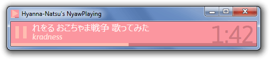
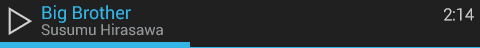

# NyawPlaying
Simple window showing "now playing" song of Foobar2000 (for use with e.g., OBS).

Developed on behalf of [Hyanna-Natsu].

## Maybe wait for the next version

Next version has theming support. It's fine to use the one that's here, but it's only pink so you may want to wait for the next one, or use the current and check later. Come here in a week or so. Examples:

## How to Install

Go to [the releases section], and download the zip file and Foobar2000 component for the latest release. Install the Foobar2000 component (`File`>`Preferences`>`Components`>`Install`, and browse to the downloaded `.fb2k-component` file), then unpack the zip file and run the program there. The component will notify the main app of what songs are playing and keep it updated (the C++ sources for it are available as a 7z file).

Both things have been compiled for Windows 32-bits (Foobar2000 is Windows-only anyway) and tested on Windows 7 64-bits.

## Limitations

Currently the start-up time is much slower than I want it to be. This will be fixed in the future (run-time is pretty lightweight, and CPU expense should be tiny).

Moreover, you'll have to bear with a pink color scheme at the moment.

## Bugs? Suggestions? Having Trouble?

Even though this was designed for a specific use-case, other people are free to use it too. The source code is open, but if you're an artist, it is probably not useful to you. Instead, if you're having any trouble with it, just [file an issue] and I'll try to help you :)

![][GA]

[Hyanna-Natsu]: http://hyanna-natsu.deviantart.com/
[the releases section]: https://github.com/CamiloMM/NyawPlaying/releases
[file an issue]: https://github.com/CamiloMM/NyawPlaying/issues
[GA]: https://ga-beacon.appspot.com/UA-29694030-4/readme?pixel
